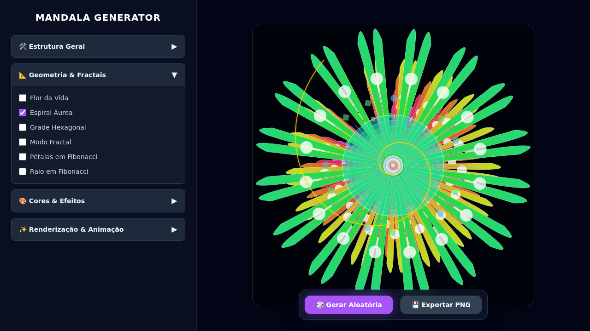

# Mandala Generator



Visualize e desenhe mandalas de forma interativa utilizando TypeScript e React. Este projeto combina arte, matemática e ciência para criar padrões geométricos fascinantes.

---

## Índice

- [Sobre o Projeto](#sobre-o-projeto)
- [Status Atual](#status-atual)
- [Funcionalidades](#funcionalidades)
- [Instalação e Execução](#instalação-e-execução)
- [Estrutura do Projeto](#estrutura-do-projeto)
- [Roteiro (Roadmap)](#roteiro-roadmap)
- [Tecnologias](#tecnologias)
- [Contribuindo](#contribuindo)

---

## Sobre o Projeto

O **Mandala** é um projeto open source que permite criar, visualizar e explorar mandalas diretamente no navegador. O objetivo é evoluir para uma ferramenta que incorpora conceitos de **Geometria Sagrada**, **Sequência de Fibonacci**, **Cosmologia** e até **NFTs**.

## Status Atual

🚧 **Em Construção** 🚧

O projeto está passando por uma reestruturação para adotar boas práticas de engenharia de software (BDD, Testes, Modularização).

## Funcionalidades

- ✅ Geração procedural de mandalas.
- ✅ Customização de pétalas, camadas, cores e complexidade.
- ✅ **[Geometria Sagrada - Proporção Áurea](docs/features/golden-spiral.md)**.
- 🔜 **Modo Fibonacci** (Em breve).
- 🔜 **Exportação para NFT** (Planejado).
- 🔜 **Temas Astrológicos** (Planejado).

---

## Instalação e Execução

### Pré-requisitos
- Node.js (v16 ou superior)

### Passos

1. Clone o repositório:
   ```bash
   git clone https://github.com/govinda777/mandala.git
   cd mandala
   ```

2. Instale as dependências:
   ```bash
   npm install
   ```

3. Inicie o servidor de desenvolvimento:
   ```bash
   npm run dev
   ```

4. Acesse `http://localhost:5173` (ou a porta indicada no terminal).

### Testes

Para rodar os testes unitários:

```bash
npm test
```

---

## Estrutura do Projeto

- `src/components`: Componentes React.
- `src/lib`: Lógica de negócios e matemática (independente de framework).
  - `mandala-math.ts`: Fórmulas e algoritmos.
  - `mandala-renderer.ts`: Lógica de desenho no Canvas.
- `src/test`: Configurações de teste.

---

## Roteiro (Roadmap)

Consulte o [BACKLOG.md](./BACKLOG.md) para ver a lista completa de tarefas e ideias futuras.

---

## Tecnologias

- [Vite](https://vitejs.dev/) - Build tool rápida.
- [React](https://react.dev/) - Biblioteca UI.
- [TypeScript](https://www.typescriptlang.org/) - Tipagem estática.
- [Vitest](https://vitest.dev/) - Framework de testes.
- [Tailwind CSS](https://tailwindcss.com/) - Estilização (via CDN ou pacote).

---

## Contribuindo

Contribuições são bem-vindas! Por favor, leia o Backlog para ver onde pode ajudar.

---

## Licença

Este projeto está licenciado sob a licença MIT.
